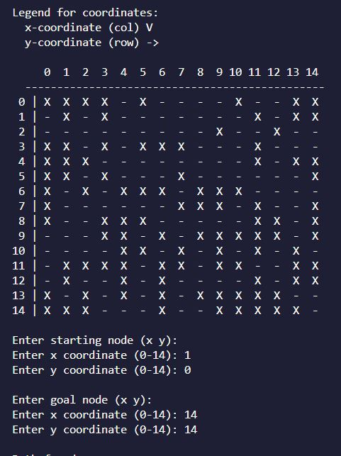
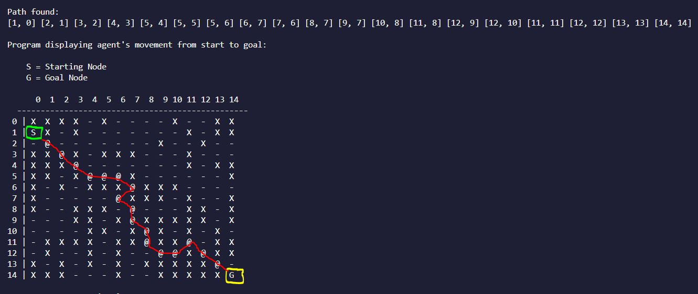

# A\* Pathfinding Visualizer

### Table of Contents

1. [Pathfinding App Overview](#pathfinding-app-overview])
2. [Key Features](#key-features)
3. [Components](#components)
4. [Real World Applications](#real-world-applications)
5. [Getting Started](#getting-started)
6. [Usage](#usage)
7. [Developed Using](#developed-using)

### Pathfinding App Overview

This Java application provides a pathfinding tool based on the A\* algorithm, allowing users to find the shortest path between two points on a grid. The app prompts users to input coordinates for the starting and goal nodes within a 15x15 grid, ensuring the chosen coordinates are within bounds and not obstructed by obstacles.

Upon receiving user input, the app employs the A\* algorithm to search for the optimal path, considering obstacles and the grid's dimensions. If a viable path exists, the app displays the coordinates of each node along the path and visualizes the agent's movement from the starting node to the goal node on the grid.

This app serves as a practical tool for understanding and implementing pathfinding algorithms, offering a hands-on approach to visualize and comprehend their functionality. Whether for educational purposes or practical applications, users can utilize this tool to navigate and analyze pathfinding scenarios within a customizable grid environment.

### Real World Applications

This pathfinding application can be utilized in various real-world scenarios where finding the shortest path between two points is essential. Some practical applications include:

`Robotics and Autonomous Vehicles`: Pathfinding algorithms are crucial for autonomous robots and vehicles to navigate efficiently in dynamic environments, avoiding obstacles and reaching their destinations safely.

`Logistics and Supply Chain Management`: In logistics operations, such as warehouse management and package delivery, optimizing routes can reduce travel time, fuel consumption, and operational costs.

`Game Development`: Pathfinding algorithms are commonly used in game development to enable non-player characters (NPCs) to navigate game environments intelligently, avoiding obstacles and pursuing objectives.

`Urban Planning and Transportation`: City planners can utilize pathfinding algorithms to optimize public transportation routes, traffic flow, and pedestrian pathways, improving overall urban mobility and reducing congestion.

`Emergency Response and Search and Rescue`: During emergencies or search and rescue missions, responders can use pathfinding algorithms to plan efficient routes to reach affected areas or locate missing individuals.

`Network Routing and Optimization`: In telecommunications and computer networks, pathfinding algorithms help determine the most efficient routes for data packets to travel from source to destination, optimizing network performance.

`Supply Chain Optimization`: Companies can utilize pathfinding algorithms to optimize their supply chain networks, including sourcing, production, distribution, and inventory management, to minimize costs and improve efficiency.

`Infrastructure Maintenance and Inspection`: Pathfinding algorithms can assist in planning inspection routes for infrastructure assets such as pipelines, power lines, and bridges, ensuring thorough coverage and timely maintenance.

Overall, this pathfinding application provides a versatile tool that can be adapted to various real-world scenarios, offering practical solutions to route optimization, navigation, and planning challenges across different domains.

### Key Features:

- Input of starting and goal node coordinates.
- Validation of user input to ensure it falls within grid bounds and avoids obstacles.
- Pathfinding using the A\* algorithm.
- Visualization of the shortest path on the grid, marked by '@', with starting node 'S' and goal node 'G'.
- Ability to generate a new grid and rerun the pathfinding process.

### Components:

1. Initializer Class:

   - Contains the main logic for initializing the grid, finding the shortest path using the A\* algorithm, and displaying the grid with the agent's movement.

   - Nested static class Node represents a single node in the grid.

2. MainApp Class:

   - Entry point of the application.

   - Calls the initialize() method of the Initializer class to start the program.

3. Grid Generation and Display:

   - The `generateGrid()` method randomly generates obstacles in the grid. It accomplishes this by assigning a value of 1 (representing an obstacle) to certain grid cells based on a probability of 50%. Each cell's value is determined independently, resulting in a grid with randomly distributed obstacles and empty spaces. Here's an example of how to use it:

     ```java
     /**
      * Generates a grid with random obstacles.
      */
     static void generateGrid() {
         grid = new int[numRows][numCols];

         for (int i = 0; i < numRows; i++) {
             for (int j = 0; j < numCols; j++) {
                 // Assign a value of 1 (obstacle) with a probability of 50% (0.5)
                 grid[i][j] = random.nextDouble() < 0.5 ? 1 : 0;
             }
         }
     }
     ```

   - The `displayGrid()` method displays the grid with obstacles and empty spaces.

4. A Pathfinding Algorithm\*:

   - The findPath() method implements the A\* algorithm to find the shortest path from the starting node to the goal node.
   - Utilizes priority queues and sets to manage open and closed sets.
   - Calculates heuristic values and tentative scores for nodes.

5. User Input and Interaction:

   - Uses Scanner to read user input for starting and goal nodes.
   - Allows users to continue or exit the program, as well as generate a new board.

6. Path Reconstruction and Display:

   - The reconstructPath() method reconstructs the path from the goal node to the starting node.
   - The displayAgentsPath() method displays the grid with the agent moving along the path, with delays between each step.

7. Randomness:

   - Utilizes Random class to introduce randomness in obstacle generation.

8. Thread Management:

   - Handles InterruptedException while displaying the grid with a delay, ensuring proper thread interruption handling.

These components work together to create a program that allows users to interactively find paths in a grid environment using the A\* algorithm.

### Getting Started:

1. Clone the repository to your local machine with one of the follow:

   HTTPS: <pre><code>git clone https://github.com/jvang0620/A-Star-Pathfinding-Visualizer</code></pre>

2. **Compile**: Compile the Java source code using `javac -d bin MainApp.java` or `javac -d bin *.java`

   - The command `javac -d bin MainApp.java` is used to compile Java source files (.java) and then place the compiled class files (.class) into a specified directory (bin in this case). Let's break down what each part of the command does:

   - `javac`: This is the Java compiler command. It compiles Java source code files (.java) into bytecode files (.class) that can be executed by the Java Virtual Machine (JVM).

   - `-d bin`: This option specifies the destination directory for the compiled class files. In this case, it's set to bin, indicating that the compiled class files should be placed in the bin directory.

   - `MainApp.java`: This is the Java source code file that you want to compile. In this case, it's assumed that MainApp.java contains the main class definition and possibly other classes used by your application.

   - `*.java`: This part of the command is a wildcard pattern that matches all the Java source files (\_.java) in the current directory. It tells the compiler to compile all Java files in the current directory.

So, when you run this command`, the Java compiler compiles all the Java files in the current directory and places the compiled class files into the bin directory. This is a common practice to organize compiled class files separately from the source code.

3. **Run**: Execute the compiled program with `java -cp bin MainApp`.

   - The command `java -cp bin MainApp` is used to run a Java program named WeddingInventorySystemGUI with its main class located in the bin directory. Let's break down what each part of the command does:

   - `java`: This is the Java interpreter command. It is used to execute Java programs.

   - `-cp bin`: This option specifies the classpath, which tells Java where to look for the compiled class files (\*.class) needed to run the program. In this case, it's set to bin, indicating that Java should look for class files in the bin directory.

   - `MainApp`: This is the name of the main class of the Java program that you want to run. When you execute this command, Java will look for a class file named WeddingInventorySystemGUI.class in the bin directory and execute its main method, which serves as the entry point of the program.

4. **Output**: The app will display in the terminal



### Usage

Inputting Coordinates:

- First, the user will input the coordinates of the starting node.
- Secondly, the user will input the coordinates of the goal node.
- The user must enter a number from 0 to 14 inclusive.

Obstacle Note:

- Note: 'X's represent obstacles, and the user cannot select an obstacle location as one of their coordinates.

Finding the Shortest Path:

- The app will run and find the shortest path.

Path Results:

- If no path is found, the app will display an error message to the end user.
- If a path is found, the app will print out the coordinates of each node along the path.

Displaying Agent's Movement:

- Furthermore, the app will display a grid with the agent moving from the starting node to the goal node.
- The agent's path is denoted by '@'.
- 'S' represents the starting node, and 'G' represents the goal node.



### Developed Using:


